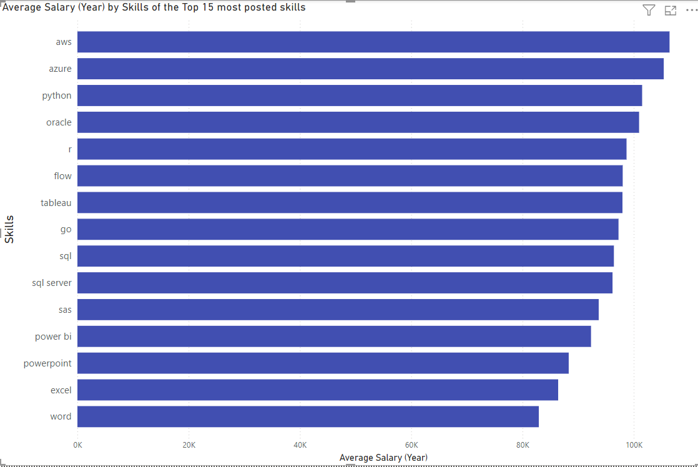
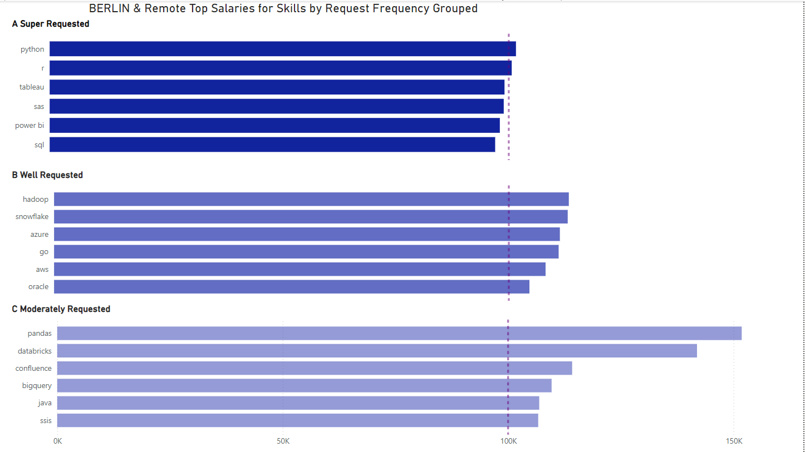

a dedicated learning projects' space for SQL-based projects;
from here you should not pull relevant infos, processes nor doc.s
as they might be full of errors, trials and otherwise mostly useless - 
learning stuff, you know
With that out of the way:

# Intro
Diving into the data-jobs market with a list of postings crawled/scraped in late 2023 to find out about skills demand, roles and their pay and where the two meet.

The actual SQL-queries repo: 
[Queries_Section folder](/project_queries/Queries_Section/)

# Background
Data Set provided by Analyst Luke Barousse, a snapshot of his datanerd.tech web app aggregating real world data roles from around the globe.
With the data aggegated like this I could venture to figure out what roles are in demand and what conditions I would meet as a job seeker in the field.
The insights to comb through include skills, salaries, locations and more.

## Questions to answer during this stage

### Top Paying Analyst Roles
 of course I would go there first: What are the top-paying data analyst jobs?

### Top Paying Job Skills
   what skills would I need to land one of those Anylyst-jobs?

### In-demand skills
  How much demand ist there for a given skill actually?

### Optimal Skills
   Combining what I learned what skills that are in high and frequent demand pay how?
    

# Tools I used
I harnessed the capabilities of a coherent stack of highly useful tools.

## SQL
    allowing to query the database with hundreds of thousands of records and a moderately complex schema efficiently

## PostgreSQL
    database management system that ideally handled the job postings data. I chose PostgreSQL to add another tool to my personal kit after having used Google Cloud and MS SQL Server Management previously

## Visual Studio (Code)
    integrated dev. environment to execute queries, troubleshoot and manage database

## Power BI
    to create visualizations and go deeper in the analysis

## GitHub
    Git-repository and version tracking and -controlling- environment to publish and collaborate

# The Analysis
Each query aimed at investigating specific aspects of the data analyst job market.
So, first in line from the summary above is:

### Top Paying Analyst Roles
 of course I would go there first: What are the top-paying data analyst jobs?

``` sql
SELECT job_id,
    job_title,
    job_location,
    company_dim.name AS company_name,
    job_schedule_type,
    salary_year_avg,
    job_posted_date
FROM job_postings_fact
LEFT JOIN company_dim
    ON job_postings_fact.company_id = company_dim.company_id
WHERE job_title_short = 'Data Analyst'
    AND salary_year_avg IS NOT NULL
    AND job_location = 'Anywhere'
ORDER BY salary_year_avg DESC
```
With the insight that the top paying remote job in the field would net me a cool 650K USD I felt I was on track! But seriously, there would be a long and arduous learning journey ahead I concluded before I could even fantasize to charge remotely anything of the kind. The next question was then:

### Which skills are the top paying?
Here I focused on Data Analyst roles around the world:

``` sql
WITH top_paying_jobs AS (
    SELECT job_id,
        job_title,
        company_dim.name AS company_name,
        ROUND(salary_year_avg,2) AS yearly_salary
    FROM job_postings_fact
    LEFT JOIN company_dim
        ON job_postings_fact.company_id = company_dim.company_id
    WHERE job_title_short = 'Data Analyst'
        AND salary_year_avg IS NOT NULL
    ORDER BY salary_year_avg DESC
 
    )
SELECT top_paying_jobs.*, --to select all the jobs collected in the CT-Expression earlier
    skills_dim.skills
FROM top_paying_jobs
INNER JOIN skills_job_dim ON top_paying_jobs.job_id = skills_job_dim.job_id
INNER JOIN skills_dim ON skills_job_dim.skill_id = skills_dim.skill_id

ORDER BY yearly_salary DESC
```


When filtering for insight in **Power BI** I decided to order the 15 most frequently named skills and rank them based on the average salary of the positions.



As we can see server and cloud infrastructure skills are frequently looked for and pay well with code languages ranking overall high as well.


### Which skills are in highest demand overall?

To learn how this applies to any lessons I can tak efrom the insights gained so far, I wanted to learn which opportunities might be there for me. Bein located in Berlin, Germany I queried for the most frequently sought after skills from postings for jobs near me or to work from home.

```sql
SELECT
    COUNT (job_postings_fact.job_id) AS n_o_jobs,
    skills AS skills_to_job
FROM job_postings_fact
INNER JOIN skills_job_dim AS sj_dim ON job_postings_fact.job_id = sj_dim.job_id
INNER JOIN skills_dim   ON sj_dim.skill_id = skills_dim.skill_id
WHERE job_title_short = 'Data Analyst'
    AND (job_location LIKE 'Berlin%' OR job_location = 'Anywhere')
    --adding these for personal interest obv., note
    -- globally (including Remote jobs, it's SQL, Excel, Python, Tableau, PowerBI) so very similar
GROUP BY skills_to_job
HAVING COUNT (job_postings_fact.job_id) > 10
ORDER BY n_o_jobs DESC
```

Again switching to **Power BI** for a graphic representation and filtering fot the Top 15 skills in Data Jobs available to me.


And if we look at the data structured by their broader types and by the total number of job postings SQL, Python and R - the languages most prevalent in Data Analysis are in high demand next to the widely used analyst tools (Excel, Power BI and Tableau).
The total request number of Cloud tool savy job offerings is quite distant with Azure, the single most requested Cloud toool only 11% as frequent as SQL the overall most requested skill.
The first amongst the database tools is Sql Server on a distant 16th overall rank.

When inspecting for how weighted the category entries are we can see that Cloud tools are very evenly distributed whereas th eProgramming and Analyst tools clearly "lump" at the most popular suites.


### Optimal Skills to Learn
With what we know already, what are the best skills to learn? - highly sought after and in great demand - as well as providing great income opportunity?
Well - let's inspect the following: Which skills are Frequently looked for and what is their average payout?

```sql
WITH d_a_skills AS
    (
    SELECT jp_fact.job_id,
        job_title,
        skills_dim.skills AS skills_to_job,
        salary_year_avg
    FROM job_postings_fact AS jp_fact
    INNER JOIN skills_job_dim ON jp_fact.job_id = skills_job_dim.job_id
    INNER JOIN skills_dim ON skills_job_dim.skill_id = skills_dim.skill_id
    WHERE job_title_short ='Data Analyst'
        AND salary_year_avg IS NOT NULL
        AND (job_location LIKE 'Berlin%' OR 
            job_location = 'Anywhere')
    GROUP BY job_title, skills_to_job,jp_fact.job_id
    )
SELECT  skills_to_job,
        ROUND(AVG (salary_year_avg),0) AS salary_per_skill,

    CASE WHEN COUNT (skills_to_job) BETWEEN 9 AND 20 THEN  'C_moderately_requested'
        WHEN COUNT (skills_to_job) BETWEEN 21 AND 60 THEN  'B_well_requested'
        WHEN COUNT (skills_to_job) > 61 THEN 'A_super_requested'
    ELSE 'Other'
    END AS frequent_skills
FROM d_a_skills
GROUP BY d_a_skills.skills_to_job
ORDER BY salary_per_skill DESC
```
When plugging the insights into **Power BI** ignoring the Other-category that have very few actual vacancies we can see th etop items from each group:


So while Python and SQL are less highly paid than Spark or Redshift they are looked after with a much, much greater frequency.
So globally Python, R and SQL seem very decent earners and safe bets, with Hadoop, Snowflake and the Cloud tools AWS and Azure showing strong as well how's the situation for job openings available to me, Data Analyst jobs in Berlin and Remote?



Here Programming skills seems to be held less highly in regard; Pandas and Databricks are strong showings despite not being sought after quite as frequently. Their integration into larger frameworks however (Python and Azure) makes them less of fundamental items instead pointing at demand from companies to fill roles specific to their data stacks' requirements.

### Another way to optimize?
Lastly I plugged in Luke Barousse's Chat GPT4 assistant for a Pivoting operation which due to th emass of data fell flat in Power BI.
While I had to troubleshoot for  afew minutes it still gave a pretty good piece of code to start working on.
What I wanted to to was pivoting the skills for each job posting into columns. While qurying I had found out that some vacancies had up to 50 or more skill items. I chose to stick with a maximum of nine skills which I sorted.

```sql
-- I wanted a Table so I thought of adding this:
CREATE TABLE skills_to_job_top_9_dim AS
--Pivoting skills to append them to job_id
--  Step 1: Identify and rank the skills for each job
WITH RankedSkills AS (
    SELECT 
        sjd.job_id,
        sjd.skill_id,
        s.skills,
        ROW_NUMBER() OVER (PARTITION BY sjd.job_id ORDER BY sjd.skill_id) AS skill_rank
    FROM 
        skills_job_dim AS sjd
    JOIN 
        skills_dim AS s ON sjd.skill_id = s.skill_id
)

--  Step 2: Pivot the ranked skills into separate columns
SELECT 
    j.job_id,
    MAX(CASE WHEN rs.skill_rank = 1 THEN rs.skills END) AS skill_1,
    MAX(CASE WHEN rs.skill_rank = 2 THEN rs.skills END) AS skill_2,
    MAX(CASE WHEN rs.skill_rank = 3 THEN rs.skills END) AS skill_3,
    MAX(CASE WHEN rs.skill_rank = 4 THEN rs.skills END) AS skill_4,
    MAX(CASE WHEN rs.skill_rank = 5 THEN rs.skills END) AS skill_5,
    MAX(CASE WHEN rs.skill_rank = 6 THEN rs.skills END) AS skill_6,
    MAX(CASE WHEN rs.skill_rank = 7 THEN rs.skills END) AS skill_7,
    MAX(CASE WHEN rs.skill_rank = 8 THEN rs.skills END) AS skill_8,
    MAX(CASE WHEN rs.skill_rank = 9 THEN rs.skills END) AS skill_9

FROM 
    job_postings_fact AS j
LEFT JOIN 
    RankedSkills AS rs ON j.job_id = rs.job_id
GROUP BY 
    j.job_id, j.job_title_short
ORDER BY 
    j.job_id

```

 I stuck with the overall spirit and fed the results to **Power BI** 's Key Influencer tool.

 And although not entirely comprehensive, the strongest predictor for a lower income seemed to be one's first skill being Excel AND one' second skill being NOT Python.

 

With 15K difference to average - ouch!

On the other end of the spectrum a number of skills can help increase one's income. The one most widely sought after tool here (Python) as a second skill is likely to increase ones salary by 8.6K !


And While PostgreSQL shows an increase of 67.8K when held as a no. 6 skill - this seems to be an unlikely bet to make.

# What I learned
Structured workflow with a side by side usage of PostgrSQL, VSCode to run SQL and Power BI with the SQL-database integrated live.
This was my most substantial Analytics-kin-of stack so far without major weaknesses or import/Transfer bottlenecks in the pipeline.
Th eproject strengthened my overall everyday command of SQL as well as the integrated case-by-case usage of the best tool for each job at hand.

# Conclusions
## Insights
The optimal single skill to have is probably Python as a second skill. It is predictive to increase one's salary, it is most predictive to lower one's salary if one doesn't have it as a second skill. Python is among the most sought after skill type and a strong single item within its peer group.

SQL is the single most prevalent skill requested in a huge number of openings and it seems very predictive of job success overall since it also scores well on the salary board.

The big analytics- and visualization-tools (Tableau and Power BI) are showing strong correlation to job success overall with a great number of analyst roles.

Cloud service skills (Azure, AWS) and data lake solutions (Hadoop, Snowflake) are strong items to have in one's personal skill stack as a data analyst moving forward.

While to work in Berlin one would find less Business Analytics roles labeled as Data Analysis but instead shows a much stonger focus on statistics and more complex analyses (SAS) or more sophisticated stack solutions (Pandas, Databricks) whilst more common coding skills like SQL are not held in high regard, considering job openings as well as salaries.
